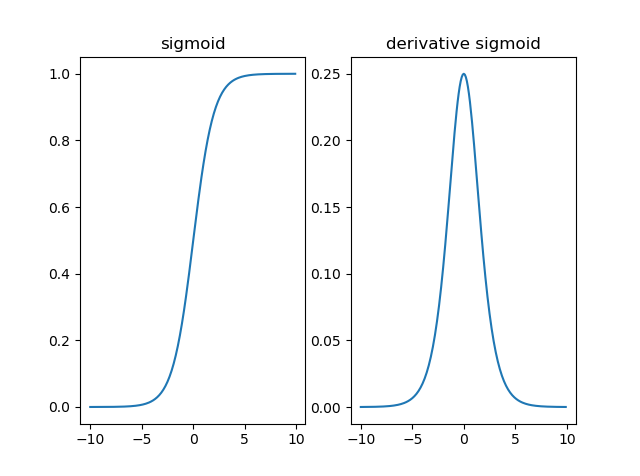
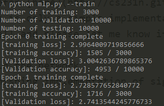

# Implementation of Backpropagation for a Multilayer Perceptron with Stochastic Gradient Descent
- The goal of this project is to gain a better understanding of backpropagation.
- At the end of this assignment, you would have trained an MLP for digit recognition using the MNIST dataset.
- The code requires a Python3 environment with Numpy and Matplotlib.
- You can find the MNIST dataset used for this project [here](data/). Follow the steps below after you have become familiar with the files provided.

## Assignment Description
### 1. Get the code
- The incomplete code for this project can be found [here](stub/). The code is modified from an online tutorial.
- Read the code and make sure to understand what happened here.

### 2. Check the Data:
- To ensure you're able to load the data correctly, run experiment/mlp.py:

```
python mlp.py --input
```
- If everything is correct, you will see the output shows 3,000 samples in training, 10,000 samples in validation and 10,000 samples in testing.

### 3. Implement the Sigmoid Function
- Complete the implementation of the sigmoid function and derivative of sigmoid in [`src/activation.py`](project/src/activation.py).
- `sigmoid(z)` returns the value of sigmoid function and `sigmoid_prime(z)` returns the value of derivative of sigmoid.
- Test the sigmoid function

```
python mlp.py --sigmoid
```
If everything is correct, you will see the plot like this:



### 4. Implement the backpropagation
- Follow the comments in [`src/bp.py`](assignment/src/bp.py) to complete the implementation of backpropagation.
- You do not have to exactly follow the comments. But make sure the function returns the correct format of data.
- To make things easier, you can use a very small network to test your implementation by modifying the input [here](https://github.ncsu.edu/qge2/ece542-2018fall/blob/master/project/01/assignment/experiment/mlp.py#L56).
- Use gradient check ([ref1](http://cs231n.github.io/neural-networks-3/#gradcheck), [ref2](http://ufldl.stanford.edu/wiki/index.php/Gradient_checking_and_advanced_optimization)) to check whether your implementation is correct or not. Here we provide a simple implementation of gradient check for one of the weights and you can try it through:

```
python mlp.py --gradient
```
- You can check other weights by changing the values of `layer_id`, `unit_id` and `weight_id`.
- Please refer [here](http://cs231n.github.io/neural-networks-3/#gradcheck) for the interpretation of the result.
- Note this is only a very simple implementation of gradient check and it is only for weights. You can implement your own version of gradient check as well and please let me know if you find any issues or bugs of this implementation.

### 5. Train the network
- Next you can train the network by running:

```
python mlp.py --train
```
You should see something like this:


- You can play with the hyperparameters (number of layers, number of hidden units, learning rate ...) to get better results.

### 6. Record the learning curve and result on testing data
- Record the learning curve for both training set and validation set during training
- Test the trained model on testing set.

## Deliverable
- Source code
- Report should include (Use [this](https://www.ieee.org/conferences/publishing/templates.html) template):
1. Final structure of the network and choice of hyperparameters.
2. Learning curve (loss and accuracy) on both training and validation set.
3. Final accuracy on the test set.

- Predictions: Please submit a CSV file with your predictions for the test set. Note that there is a separate link for this submission. The data should be in one-hot encoding format. That is, each row should be a set of zeros with only a one on the value that you predicted (e.g., the value with the largest probability). The column entries should be in ascending order based on the label (i.e., the ‘0’ label goes first all the way to ‘9’). Finally, each row should be the prediction for the corresponding test entry. Make sure they are all in the same order. If you did this correctly, you should end up with a table of size 1000 rows by 10 columns

## Useful links:
- http://cs231n.github.io/neural-networks-3/#sgd
